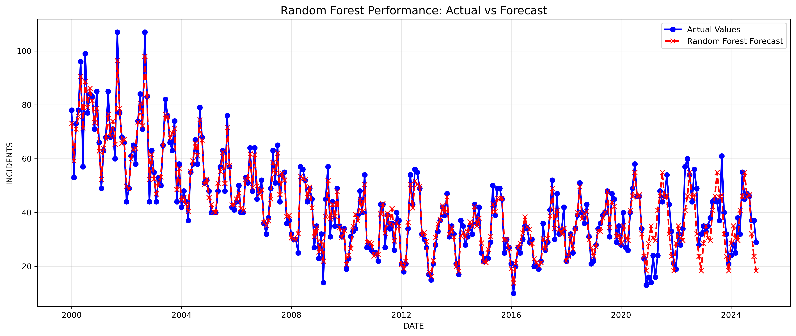

# 🚗 Munich Alcohol-Related Accident Predictor


This project is a Machine Learning API developed for the **Digital Product School (DPS) AI Challenge**. It predicts the number of alcohol-related traffic accidents in Munich for any given month and year.

## 📊 Project Overview

The goal was to analyze historical traffic accident data from the Munich Open Data Portal (2000–2021) and create a forecasting model. The solution is deployed as a REST API that accepts a year and month and returns a prediction.

### 📉 Performance Visualization


## 🧠 Methodology & Model Selection

I evaluated two different approaches to solve this time-series regression problem: **SARIMA** and **Random Forest**.

### 1. Data Analysis
The data showed a clear seasonal pattern (peaks in summer, lows in winter) and a consistent trend up until 2019. However, **2020 marked a significant structural break** due to the COVID-19 pandemic, where accident numbers dropped drastically.

### 2. Why Random Forest? (The Winner)
Initially, I implemented a **SARIMA** model. While it captured seasonality well, it failed to adapt quickly to the sudden drop in 2020, over-predicting values based on the pre-pandemic trend.

I switched to a **Random Forest Regressor** because:
* **Adaptability:** It treats time (`Year`, `Month`) as features rather than a strict sequence, allowing it to learn the "New Normal" of 2020-2021 as a distinct condition.
* **Performance:** The Random Forest significantly outperformed SARIMA in error metrics.

*Conclusion: The Random Forest model is **more accurate** on the test data.*

## 🛠️ Tech Stack

* **Language:** Python 3.12
* **ML Library:** Scikit-Learn (Random Forest Regressor)
* **Data Manipulation:** Pandas
* **API Framework:** FastAPI
* **Server:** Uvicorn
* **Deployment:** Render (Cloud)

## 🚀 How to Run Locally

If you want to run this API on your own machine:

1.  **Clone the repository**
    ```bash
    git clone [https://github.com/okizartici/munich_accidents_forecast_model.git](https://github.com/okizartici/munich_accidents_forecast_model.git)
    cd munich_accidents_forecast_model
    ```

2.  **Create a virtual environment**
    ```bash
    python3 -m venv .venv
    source .venv/bin/activate  # On Windows: .venv\Scripts\activate
    ```

3.  **Install dependencies**
    ```bash
    pip install -r requirements.txt
    ```

4.  **Run the API**
    ```bash
    uvicorn main:app --reload
    ```
    The app will start at `http://127.0.0.1:8000`.

## ☁️ API Usage (Deployed)

The model is deployed on Render. You can send `POST` requests to the `/predict` endpoint.

**Base URL:** `https://dps-challenge-okizartici.onrender.com`

### Example Request
**Endpoint:** `/predict`
**Method:** `POST`

**Body (JSON):**
```json
{
  "year": 2021,
  "month": 12
}
